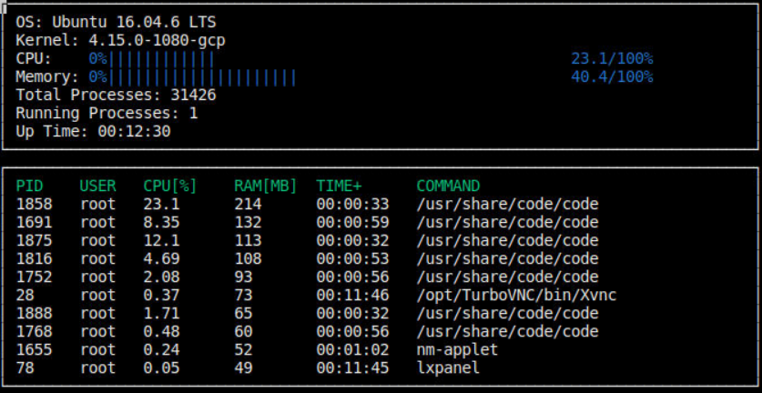

# CppND-System-Monitor

## ncurses
[ncurses](https://www.gnu.org/software/ncurses/) is a library that facilitates text-based graphical output in the terminal. This project relies on ncurses for display output.

## Make
This project uses [Make](https://www.gnu.org/software/make/). The Makefile has four targets:
* `build` compiles the source code and generates an executable

* `clean` deletes the `build/` directory, including all of the build artifacts

## Instructions

1. Build the project: `make build`

2. Run the resulting executable: `./build/monitor`
